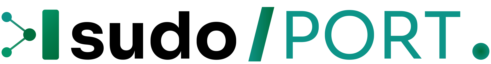

<!-- GENERATED BY SUDOPORT PROJECT PAGE -->

  <picture>
    <source media="(prefers-color-scheme: dark)" srcset=".github/assets/sudo-port-logo-dark.svg">
    <source media="(prefers-color-scheme: light)" srcset=".github/assets/sudo-port-logo-light.svg">
    
  </picture>

    

  <picture>
    <source media="(prefers-color-scheme: dark)" srcset=".github/assets/project-profile-dark.svg">
    <source media="(prefers-color-scheme: light)" srcset=".github/assets/project-profile-light.svg">
    
  </picture>

# Phil4Kids

Webauftritt für Kindermusik, Bewegung und spielerische Gesundheitsförderung.

## Projekt auf einen Blick

| Merkmal | Einordnung |
| --- | --- |
| Kategorie | Kundenprojekt |
| Status | Webauftritt in Entwicklung |
| Zielgruppe | Kinder, Familien sowie pädagogische Einrichtungen, die Musik, Bewegung und Gesundheitsförderung spielerisch verbinden möchten. |
| Verantwortung | sudo/PORT — Nico Freitag und Kevin Kröger |

## Funktionsschwerpunkte

- kindgerechter Webauftritt für Musik, Bewegung und Ernährung
- strukturierte Darstellung von Songs, Mitmachideen und pädagogischem Ansatz
- responsive Website mit eigenständiger Phil4Kids-Markenwelt

## Repository-Grenze

Das Repository bildet den Webauftritt ab; pädagogische Inhalte, Musikrechte und fachliche Freigaben verbleiben beim Projektinhaber.

## Technischer Überblick

`Next.js 14.2.15` · `React 18.2.0` · `TypeScript 5` · `Tailwind CSS 4`

Im Repository liegen:

- Quellcode und wiederverwendbare Implementierung

## Produktansichten

Screenshots werden ergänzt, sobald eine öffentliche Oberfläche oder ein bereinigter Demo-Datensatz
vorliegt. Produktive Kunden-, Personen-, Vertrags- und Betriebsdaten werden nicht für GitHub-Bilder verwendet.

## Dokumentation und Einstieg

- [README.md](README.md) — Technischer Einstieg und lokale Arbeit
- [CHANGELOG.md](CHANGELOG.md) — Änderungshistorie

---

[← Zur technischen README](README.md) · [sudo/PORT-Projektkatalog](https://github.com/sudo-PORT/.github/blob/main/profile/PROJECTS.md) · [sudoport.de](https://sudoport.de)
